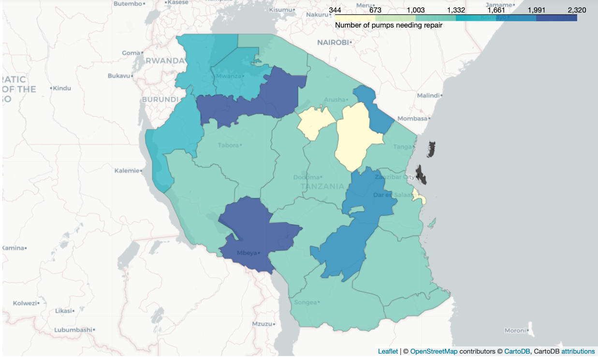

# Problem Description:

Though an open source coding effort Taarifa - a group of volunteer coders in Tanzania -  put together a dashboard to monitor public infrastructure.  The data in this collection is on water well systems.  When communities are without water they suffer in many ways.  More time needs to be spent on water collection and less time can be spent on work or income generation.  Poor water sources may be used leading to health problems.  In some cases a broken well can cause death.

The Tanzanian government does not have the resources to continually inspect these wells and the communities they serve may not have the means to communicate to officials when the wells stop working.

The purpose of this project is to use the data to anticipate when a well needs repair, **ideally before it breaks** so the pump can be repaired before it disrupts the local water supply.

The primary focus of this work is to identify as many of the wells that need repair as possible from the existing data provided by Taarifa.

# Data Description

* `amount_tsh` - Total static head (amount water available to waterpoint)
* `date_recorded` - The date the row was entered
* `funder` - Who funded the well
* `gps_height` - Altitude of the well
* `installer` - Organization that installed the well
* `longitude` - GPS coordinate
* `latitude` - GPS coordinate
* `wpt_name` - Name of the waterpoint if there is one
* `num_private` -
* `basin` - Geographic water basin
* `subvillage` - Geographic location
* `region` - Geographic location
* `region_code` - Geographic location (coded)
* `district_code` - Geographic location (coded)
* `lga` - Geographic location
* `ward` - Geographic location
* `population` - Population around the well
* `public_meeting` - True/False
* `recorded_by` - Group entering this row of data
* `scheme_management` - Who operates the waterpoint
* `scheme_name` - Who operates the waterpoint
* `permit` - If the waterpoint is permitted
* `construction_year` - Year the waterpoint was constructed
* `extraction_type` - The kind of extraction the waterpoint uses
* `extraction_type_group` - The kind of extraction the waterpoint uses
* `extraction_type_class` - The kind of extraction the waterpoint uses
* `management` - How the waterpoint is managed
* `management_group` - How the waterpoint is managed
* `payment` - What the water costs
* `payment_type` - What the water costs
* `water_quality` - The quality of the water
* `quality_group` - The quality of the water
* `quantity` - The quantity of water
* `quantity_group` - The quantity of water
* `source` - The source of the water
* `source_type` - The source of the water
* `source_class` - The source of the water
* `waterpoint_type` - The kind of water point
* `waterpoint_type_group` - The kind of water point

# Wells needing Repair

The data includes 27,000 wells that need repair.

This map shows the concentration of the wells we know are non functional from our data. In reality there are many more wells because we are only working with a portion of the total data. But because of the size of our data we can expect this proportion to roughly represent the whole.



## Dry wells

The word "Dry" comes up in the `quantity` column which indicates the amount of water available.  If a source is dry we would expect the pump to be non functional, but not in need of repair.  The problem isn't the pump, its the source of water.

Lets look at the number of wells that have 'Dry' anywhere in their record and see how many of them are functional.


## Extraction type class: submersible

Similar exploration of the `extraction_type_class` submersible. We want to see if it correlates to the `status_class` in any way.


Very few of the submersible type wells are functional need's repair.  This seems to indicates that the submersible pumps either work or don't which means that we might intervention strategies for these pumps that don't involve waiting for the pump to show signs of needing repair.

# Preprocessing and Cleaning

All preprocessing was done by using a combination of sklearn's Pipeline and ColumnTransformer, and IMBLearn's pipeline for resampling.  The pipeline did the following

* Separating Categorical and Continuous variables
* Identifying values used to represent missing values
* Adding log functions to positive valued columns: `population` `amount_tsh`, `num_private`
* Removing categorical columns with redundant data
* Reducing the cardinality of the large categorical columns
  * This was done with a custom transformer in the [functions.py](functions.py) helper file

The final preprocessing pipeline:


# Class Imbalance

For models which have a `class_weight` attribute I tested both SMOTE and the the use of `class_weight`.  In order to do that I had to create a separate pipeline for each.  For the smote pipeline I used the IMBPipeline rather than sklearn's because the former does not perform resampling when predicting.


# Modeling

## Evaluation Metric

Evaluation results were chosen using the recall_macro scorer.  The recall_macro scorer calculates recall for each class and takes an average.  This gives greater weight to smaller classes which is idea for this project.  Recall was chosen as the metric because it tells us the amount of values in each class our model accurately captured.

## Subsampling

Because of the size of the data and the time required to perform the preprocessing per fold in GridSearchCV I did most of the modeling on a subsample of the data, then retained the best performing model on al of the data at the end of the process.

Modeling involved iterating through parameters of the following model types with GridSearchCV on the following model types

* K-Nearest Neighbors - KNNClassifier
* Decision Tree - DecisionTreeClassifier
* Random Forest - RandomForestClassifier
* XGBoost - XGBClassifier

## Best Performing Model - Random Forest

The best performing model was a RandomForest Model.  The final results were

```
                         precision    recall  f1-score   support

             functional       0.80      0.71      0.75      6434
functional needs repair       0.26      0.74      0.38       886
         non functional       0.84      0.67      0.74      4560

               accuracy                           0.70     11880
              macro avg       0.63      0.71      0.63     11880
           weighted avg       0.78      0.70      0.72     11880
```

### Confusion Matrix


### Feature importance


# Recommendations

## Is this the right question?

It’s not clear that asking whether a well is functional, functional needs repair, non functional is the best question to serve the purpose of this project. If we instead try to determine whether a well needs repair/does not need repair we can incorporate strategies into the data processing and prediction process that eliminate wells that cannot be repaired or that have been determined to have reached the end of their life.

## Data collection

It would benefit future projects on this data to modify the data collection to include:

* Identification of wells that cannot be repaired so that resources are not sent back to that well in the future and productive decisions can be made about how to get water to people around those wells.
* an observation dates in the data. With observation dates we could start to identify patterns in well functionality and setup maintenance schedules accordingly.
* the unique id of each well would make the process of recording data less cumbersome and more accurate allowing us to identify wells that have problems more often than others.

# Conclusion

2 of our models did well at predicting different metrics.  The overall best model was Random Forrest which performed considerably better than other models at predicting which wells were functional but need repair.


```
Repo Structure

├── 1_Preprocessing.ipynb     <--- preprocessing notebook
├── 2_Modeling.ipynb          <--- modeling notebook
├── data/                     <--- data used in this project
├── helpers.py                <--- helper functions
├── images/                   <--- images directory
├── presentation.pdf          <--- pdf of presentation slides
└── readme.md                 <--- this file
```

